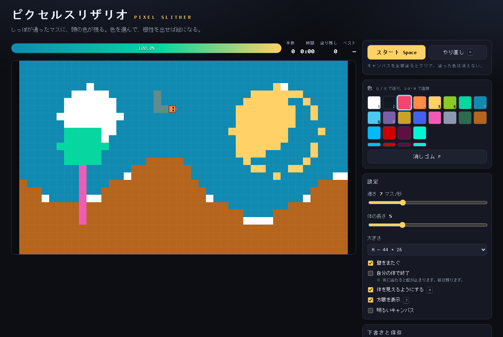

# ピクセルスリザリオ

蛇のしっぽが通ったマスに、頭の現在色が残るゲームです。
軌跡がそのまま絵になります。動くのは WASD か矢印だけで、
描くために選ぶものは色だけです。

ブラウザだけで動きます。ビルドもサーバーも不要で、GitHub Pages に置くだけで公開できます。



上の絵は `npm run shot` でプログラムから描いたものです。実際は蛇のしっぽで 1 マスずつ塗ります。

## 遊びかた

1. <kbd>Space</kbd> でスタート。
2. <kbd>WASD</kbd> か矢印で蛇を動かします。
3. 途中で何度でも方向を変えられます。そのたびにしっぽが通ったマスに色が塗られます。
4. 色を 1 つずつ選びながら動かし続けて、絵を描きます。
5. 全マスを塗るとクリアです。`P` で PNG として書き出せます。

自分の体に当たっても死な castigoにはなりません。描いて消しても問題ありません。「やり直し」を押すと蛇だけ中央に戻ります。
「自分の体で終了」を有効にすると、普通にスネークの挙動になります。

## 操作

| 操作 | キー |
| --- | --- |
| 移動 | <kbd>W</kbd><kbd>A</kbd><kbd>S</kbd><kbd>D</kbd> / <kbd>↑</kbd><kbd>↓</kbd><kbd>←</kbd><kbd>→</kbd> |
| 開始・一時停止 | <kbd>Space</kbd> |
| 色を 1 つ選ぶ | <kbd>1</kbd> から <kbd>9</kbd>、<kbd>0</kbd> |
| 色を順番に送る | <kbd>Q</kbd> <kbd>E</kbd> |
| 消しゴム | <kbd>F</kbd> |
| やり直し (絵は残る) | <kbd>R</kbd> |
| 全消し | <kbd>C</kbd> |
| PNG 書き出し | <kbd>P</kbd> |
| 体の表示 | <kbd>H</kbd> |
| 下書きの表示 | <kbd>G</kbd> |
| 方眼の表示 | <kbd>J</kbd> |

タッチ端末ではキャンバスをスワイプして操作します。

## そのほかの機能

- **下書き画像** … 画像を読み込むと背後に薄く表示されます。写真などを薄い下書きに見ながらなぞると、絵のトレース練習になります。<kbd>G</kbd> で表示を切り替えます。
- **色** … 固定 16 色とカスタム 4 枠です。カスタム枠は下にある細いバーをクリックすると色を変えられます。
- **大きさ** … S (32×20) / M (44×26) / L (60×36) の 3 種類。
- **速さと体の長さ** … スライダーでいつでも変更できます。体の長さは走行中でも変えられます。
- **自動保存** … 絵は 2.5 秒ごととページを離れるときに `localStorage` へ保存されます。ブラウザを閉じても残ります。
- **ベスト記録** … 全マスを塗ったときの最小手数を、大きさごとに記録します。

## 動かす

依存パッケージはありません。Node 20 があれば動きます。

```bash
npm start           # http://localhost:8098 でサーバを立てる
npm test            # 構文チェック + ロジック + ブラウザ実機
npm run test:browser  # ブラウザ実機だけ
npm run shot        # docs/screenshot.png を作り直す
```

`npm test` の中のブラウザ実機は Chrome / Edge を headless で起こして
実際にキー入力し、canvas に色が出るかまで見ます。
ブラウザが無い環境ではその項目だけ省いて通ります。

`npm start` は `npx serve` を使います。`js/` は ES モジュールなので、
`index.html` を直接開くのではなく HTTP で開いてください。

```bash
python -m http.server 8098    # Python があるとき
```

## GitHub Pages で公開する

1. このフォルダを新しいリポジトリにして `main` ブランチへ push します。

   ```bash
   cd pixel-slither
   git init -b main
   git add .
   git commit -m "ピクセルスリザリオ 初版"
   gh repo create pixel-slither --public --source=. --push
   ```

2. リポジトリの **Settings → Pages** を開きます。
3. **Build and deployment → Source** を **GitHub Actions** にします。
4. **Actions** タブの `Deploy to GitHub Pages` が通ると公開されます。
   URL は `https://<アカウント名>.github.io/<リポジトリ名>/` になります。

`main` に push するたびにテストが走って、Pages へ自動で反映されます。
`.nojekyll` を同梱しているので Jekyll のビルドによるファイル削減は起きません。

## ファイルの構成

```
index.html            画面
css/style.css         見た目
js/main.js            配線と 1 tick のループ
js/core/util.js       汎用の純粋関数
js/core/input.js      キーボード・タッチ・スワイプ
js/core/save.js       localStorage への保存と復元
js/data/colors.js     パレット
js/game/state.js      ゲームの判断 (1 tick の処理)
js/game/paint.js      絵の Base64 化と PNG 用のピクセル列
js/ui/render.js       canvas への描画
js/ui/palette.js      色のボタン
js/ui/hud.js          数値表示
test/state.test.js    ゲームのロジック
test/save.test.js     絵の保存とパレット
test/store.test.js    保存と復元
test/browser.test.js  ブラウザ実機 (headless)
test/shot.mjs         スクリーンショット作成
test/all.mjs          npm test の入口
```

判断のロジックは `js/game/state.js` にだけ書いてあります。描画も保存もここに依存しません。
`step()` は「今の状態を入れると次の状態とイベントが返る」形なので、
オンライン化する場合はこの入出力をそのまま送受信できます。

## オンライン版について

まだ入れていません。費用ゼロの方法がいくつかあります。

- **WebRTC + 公開シグナリング** … PeerJS の公開サーバや MQTT over WSS を使えばサーバー代なしで P2P できます。部屋の中で 1 色でも絵を合わせる遊びに向きます。
- **Cloudflare Workers の無料枠** … 1 日 10 万リクエストまで無料なので、小規模な部屋には十分対応します。
- **手動シグナリング** … 招待コードをコピー＆ペーストする方式です。完全に無料ですが手間はかかります。

どの方式でも `js/game/state.js` の `step()` を基準にして、
自分の操作だけを先に反映し、相手から届いた入力を tick 順に並べる形にすると動きます。
今は 1 人で遊べるので、まずこの構成を保っておくと後づけが楽です。

## ライセンス

MIT
