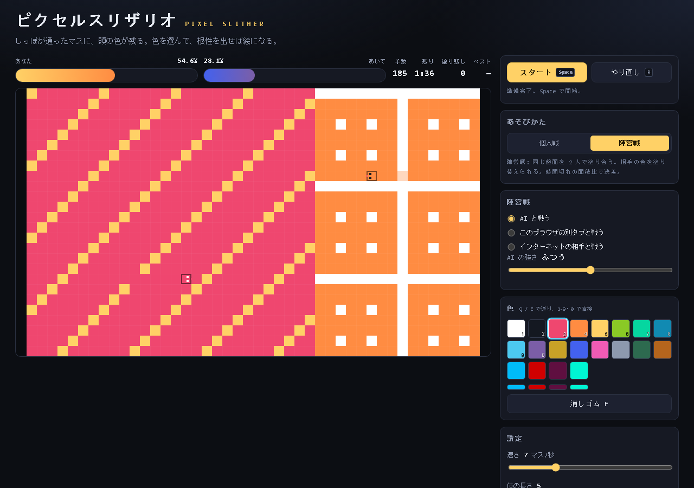

# ピクセルスリザリオ

蛇のしっぽが通ったマスに、頭の現在色が残るゲームです。
軌跡がそのまま絵になります。動くのは WASD か矢印だけで、
描くために選ぶものは色だけです。

ブラウザだけで動きます。ビルドもサーバーも不要で、GitHub Pages に置くだけで公開できます。

**あそびに ==> [https://tatudrag0n.github.io/pixel-slither/](https://tatudrag0n.github.io/pixel-slither/)**


上の絵は `npm run shot` でプログラムから描いたものです。実際は蛇のしっぽで 1 マスずつ塗ります。

## 2 つのあそびかた

右の「あそびかた」で個人戦 / 陣営戦を切り替える。

### 個人戦

1 人でキャンバスを埋める。色を 1 つずつ選びながら動くと軌跡が絵になる。
全マスを塗るとクリア。`P` で PNG として書き出せる。
自分の体に当たっても死なないので、描いて消しても問題ありません。

### 陣営戦

同じ盤面を 2 人で塗り合う。Splatoon の Turf War と同じ考え方。

- 自分の色と相手の色を同じ盤面上に置く。**相手の色は塗り替えられる。**
- 3 分で時間切れ。塗り面積が多い方が勝つ。同率なら引き分け。
- 蛇 1 本が 1 tick に塗れるのは 1 マスだけ。効率と時間の勝負。
- 自分の体に当たるか壁にぶつかったら、その場で脱落。相手が勝ちになる。
- 相手は 3 通りから選ぶ: AI / このブラウザの別タブ / インターネット。

面積のグラフが 2 本の棒で上に出る。どちらが有利かひと目で分かる。



## 対戦のつなぎ方

費用ゼロで動きます。どの経路でも中身は同じコードなので、格子 delay だけが変わる。

| 相手 | 方式 | 費用 | 必要なもの |
| --- | --- | --- | --- |
| AI | `js/game/ai.js` がその場で考える | 0 | なし |
| このブラウザの別タブ | `BroadcastChannel` | 0 | 2 枚タブを開くだけ |
| インターネット | PeerJS の公開シグナリング | 0 | 部屋コード 6 文字 |

### 別タブで遊ぶ

1. 「陣営戦 → このブラウザの別タブと戦う」を選ぶ。
2. 「部屋を作る」を押すと 6 文字のコードが出る。
3. 同じブラウザで 2 つめのタブを開き、コードを入れて「入る」。
4.  ホスト側のタブの盤面がそのまま共有される。

これがそのままテストにも使っている。`npm run test:duel` が 2 枚タブを自動で立てて、
絵のマス目まで一致するまで確認する。

### インターネットで遊ぶ

1. 「陣営戦 → インターネットの相手と戦う」を選ぶ。
2. ホストは「部屋を作る」でコード 发布、相手に渡す。
3. 相手はコードを入れて「入る」。

部屋コードは Peer の ID そのもの。アカウント登録もサーバー代は不要。
PeerJS の公開シグナリングを CDN から読むので、CDN を遮るとこの経路だけ使えない。
その場合は別タブで遊ぶか、下の Cloudflare Workers に入れ替える。

### どう 動くか (ホスト権威モデル)

- ホストが 2 本の snake を進めて、状態を毎 tick 送る。
- ゲストは入力だけを送り、受け取った状態を描くだけ。ローカルでは進めない。
- 送るものは 1 tick で変わったマスだけ。1 tick あたり数十バイト。
- 参加時に絵 1 枚を Base64 でまとめて送り、以降は差分。

回線を切っても再戦できる。PeerJS のシグナリングは小さいので、3 分 1 本なら余裕。

## 操作

| 操作 | キー |
| --- | --- |
| 移動 | <kbd>W</kbd><kbd>A</kbd><kbd>S</kbd><kbd>D</kbd> / <kbd>↑</kbd><kbd>↓</kbd><kbd>←</kbd><kbd>→</kbd> |
| 開始・一時停止 | <kbd>Space</kbd> |
| 色を 1 つ選ぶ | <kbd>1</kbd> から <kbd>9</kbd>、<kbd>0</kbd> |
| 色を順番に送る | <kbd>Q</kbd> <kbd>E</kbd> |
| 消しゴム | <kbd>F</kbd> (個人戦のみ) |
| やり直し (絵は残る) | <kbd>R</kbd> |
| 全消し | <kbd>C</kbd> |
| PNG 書き出し | <kbd>P</kbd> |
| 体の表示 | <kbd>H</kbd> |
| 下書きの表示 | <kbd>G</kbd> |
| 方眼の表示 | <kbd>J</kbd> |

タッチ端末ではキャンバスをスワイプして操作します。

## そのほかの機能

- **下書き画像** … 画像を読み込むと背後に薄く表示されます。写真などを薄い下書きに見ながらなぞると、絵のトレース練習になります。<kbd>G</kbd> で表示を切り替えます。
- **色** … 固定 16 色とカスタム 4 枠です。カスタム枠は下にある細いバーをクリックすると色を変えられます。
- **大きさ** … S (32×20) / M (44×26) / L (60×36) の 3 種類。
- **速さと体の長さ** … スライダーでいつでも変更できます。体の長さは走行中でも変えられます。
- **自動保存** … 絵は 2.5 秒ごととページを離れるときに `localStorage` へ保存されます。ブラウザを閉じても残ります。
- **ベスト記録** … 全マスを塗ったときの最小手数を、大きさごとに記録します。

## 動かす

依存パッケージはありません。Node 20 があれば動きます。

```bash
npm start             # http://localhost:8098 でサーバを立てる
npm test              # 構文チェック + ロジック + ブラウザ実機 + 2 タブ対戦
npm run test:browser  # ブラウザ実機だけ
npm run test:duel     # 2 タブの対戦だけ
npm run shot          # スクリーンショットを作り直す
```

`npm test` は 5 段構え。

| スイート | 見るもの |
| --- | --- |
| 構文チェック | 全ファイルの `node --check` |
| `state.test.js` | 塗り替え、面積計算、脱落、時間切れ |
| `save.test.js` | 絵の Base64、パレット |
| `store.test.js` | 保存と復元、壊れたデータへの耐性 |
| `net.test.js` | AI の判断、部屋コード、ホスト/ゲストの同期 |
| `browser.test.js` | 実ブラウザでキー入力、canvas 描画、陣営戦 |
| `duel.test.js` | 2 枚タブで実際に戦わせて絵まで一致するか |

ブラウザが無い環境ではブラウザ系 2 つだけ省いて通ります。

公開済みのサイトそのものも同じテストで確認できる。

```bash
TARGET_URL=https://tatudrag0n.github.io/pixel-slither/ npm run test:browser
```

`npm start` は `npx serve` を使います。`js/` は ES モジュールなので、
`index.html` を直接開くのではなく HTTP で開いてください。

```bash
python -m http.server 8098    # Python があるとき
```

## GitHub Pages で公開する

1. このフォルダを新しいリポジトリにして `main` ブランチへ push します。

   ```bash
   cd pixel-slither
   git init -b main
   git add .
   git commit -m "ピクセルスリザリオ 初版"
   gh repo create pixel-slither --public --source=. --push
   ```

2. リポジトリの **Settings → Pages** を開きます。
3. **Build and deployment → Source** を **GitHub Actions** にします。
4. **Actions** タブの `Deploy to GitHub Pages` が通ると公開されます。
   URL は `https://<アカウント名>.github.io/<リポジトリ名>/` になります。

`main` に push するたびにテストが走って、Pages へ自動で反映されます。
`.nojekyll` を同梱しているので Jekyll のビルドによるファイル削減は起きません。

## ファイルの構成

```
index.html            画面
css/style.css         見た目
js/main.js            配線と 1 tick のループ
js/core/util.js       汎用の純粋関数
js/core/input.js      キーボード・タッチ・スワイプ
js/core/save.js       localStorage への保存と復元
js/data/colors.js     パレット
js/game/state.js      ゲームの判断 (1 tick の処理)
js/game/paint.js      絵の Base64 化と PNG 用のピクセル列
js/game/ai.js         AI の判断
js/net/channel.js     通信の土台 (送信・受信・閉じるだけ)
js/net/netplay.js     ホストとゲストの同期
js/net/tabs.js        別タブとの対戦 (BroadcastChannel)
js/net/peer.js        インターネットとの対戦 (PeerJS)
js/ui/render.js       canvas への描画
js/ui/palette.js      色のボタン
js/ui/hud.js          数値表示
test/state.test.js    ゲームのロジック
test/save.test.js     絵の保存とパレット
test/store.test.js    保存と復元
test/net.test.js      AI と同期
test/browser.test.js  ブラウザ実機 (headless)
test/duel.test.js     2 タブの実対戦
test/shot.mjs         スクリーンショット作成
test/all.mjs          npm test の入口
```

判断のロジックは `js/game/state.js` にだけ書いてあります。描画も保存も通信もここに依存しません。
`step()` は「今の状態を入れると次の状態とイベントが返る」形なので、
その 1 つの関数だけを回して配列を送れば、そのまま online 対戦になります。
実際にそうして動いている。

## これからできること

- **Cloudflare Workers の無料枠** … 1 日 10 万リクエストまで無料。シグナリングを自前にすれば PeerJS への依存と制限がなくなる。`js/net/` の箱を差し替えるだけ。
- **4 人対戦** … `players()` は配列なので、陣営を 4 つに広げるのは配列を 1 つ増やすだけで済む。
- **リプレイ** … 1 tick ごとに変わったマスを並べておけば、あとから再生できる。
- **戦跡の可視化** … 1 tick で変わったマスを記録しておくと、どこを掘り返したかが後から読める。

## ライセンス

MIT
